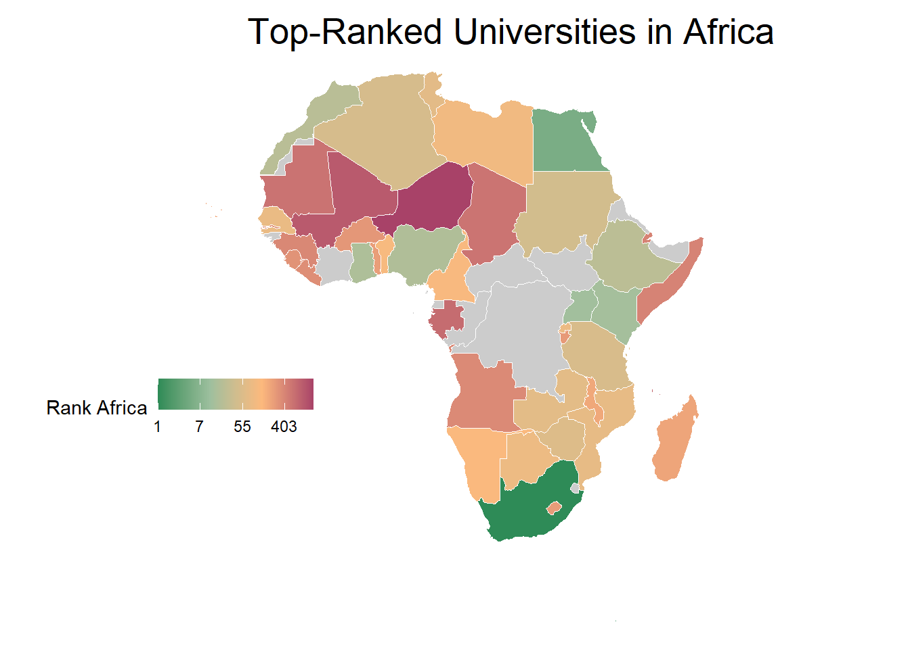

<!-- README.md is generated from README.Rmd. Please edit that file -->

# universityrankingafrica

<!-- badges: start -->
<!-- badges: end -->

This packages combines data collected as part of an MSc. Thesis Project.
The project was supported by the Global Health Engineering group at ETH
Zurich, Switzerland.


## Installation

You can install the development version of universityrankingafrica from
[GitHub](https://github.com/) with:

``` r
# install.packages("devtools")
devtools::install_github("openwashdata/universityrankingafrica")
```

Alternatively, you can download the dataset as a CSV or XLSX file from
the table below.

| dataset                 | CSV                                                                                                              | XLSX                                                                                                               |
|:------------------------|:-----------------------------------------------------------------------------------------------------------------|:-------------------------------------------------------------------------------------------------------------------|
| universityrankingafrica | [Download CSV](https://github.com/openwashdata/universityrankingafrica/inst/extdata/universityrankingafrica.csv) | [Download XLSX](https://github.com/openwashdata/universityrankingafrica/inst/extdata/universityrankingafrica.xlsx) |

## MSc. Thesis Project

### Description

### Research Question

### Data

The package provides access to one data set.

``` r
library(universityrankingafrica)
```

The `universityrankingafrica` data set has 27 variables and 141
observations. For an overview of the variable names, see the following
table.

``` r
universityrankingafrica
```

| variable_name                  | variable_type                            | description                                                                                                                                                                                                                                                                                                                                                                                                                                                 |
|:-------------------------------|:-----------------------------------------|:------------------------------------------------------------------------------------------------------------------------------------------------------------------------------------------------------------------------------------------------------------------------------------------------------------------------------------------------------------------------------------------------------------------------------------------------------------|
| University                     | string                                   | Name of the University                                                                                                                                                                                                                                                                                                                                                                                                                                      |
| Country                        | drop-down from List of African countries | Country where the University is located                                                                                                                                                                                                                                                                                                                                                                                                                     |
| City                           | string                                   | City where the University is located                                                                                                                                                                                                                                                                                                                                                                                                                        |
| ROR entry correct              | y / n                                    | Is the entry on the ror.org-website corresponding to the University correct? In most “n”-cases, the stated website is incorrect                                                                                                                                                                                                                                                                                                                             |
| URL                            | URL                                      | Official website of the University                                                                                                                                                                                                                                                                                                                                                                                                                          |
| Website Secure                 | y / n                                    | Does the website use https? Is there no security related pop-up upon opening the website?                                                                                                                                                                                                                                                                                                                                                                   |
| Website up to date             | y / n                                    | Are news articles on the website up to date OR is the copyright date of the website the current year?                                                                                                                                                                                                                                                                                                                                                       |
| Website Function               | good / medium / poor / defunct           | Good: navigating through the website is smooth, no OR very few dead or redundant links. Medium: some dead links within the webpage, some placeholders (“lorem ipsum”) still visible, some blank or empty pages. Poor: Navigating through the website is very difficult. Defunct: the official link of the university’s website is no longer hosted, or is otherwise inaccessible. Note: Does NOT indicate how much information can be found on the website. |
| Website Language               | string                                   | Default language of the landing site                                                                                                                                                                                                                                                                                                                                                                                                                        |
| Colonial Power at Independence | string                                   | The colonial Power from which the country gained independence, if it ever was colonized or became independent.                                                                                                                                                                                                                                                                                                                                              |
| Rank Africa                    | int                                      | The rank of the University in Africa, according to <https://www.webometrics.info/en/Ranking_africa>                                                                                                                                                                                                                                                                                                                                                         |
| Rank World                     | int                                      | The rank of the University in the World, according to <https://www.webometrics.info/en/Ranking_africa>                                                                                                                                                                                                                                                                                                                                                      |
| Impact Rank                    | int                                      | The impact rank of the University, according to <https://www.webometrics.info/en/Ranking_africa>                                                                                                                                                                                                                                                                                                                                                            |
| Openness Rank                  | int                                      | The openness rank of the University, according to <https://www.webometrics.info/en/Ranking_africa>                                                                                                                                                                                                                                                                                                                                                          |
| Excellence Rank                | int                                      | The excellence rank of the University, according to <https://www.webometrics.info/en/Ranking_africa>                                                                                                                                                                                                                                                                                                                                                        |
| Academic System Used           | American / French                        | Which academic system is used at the University: American (Undergraduate, Graduate, Doctorate) or French (LMD: Licence, Master, Doctorat)                                                                                                                                                                                                                                                                                                                   |
| Number of Engineering Courses  | int                                      | The number of different undergraduate engineering courses the University offers.                                                                                                                                                                                                                                                                                                                                                                            |
| Years of Study                 | int                                      | Stated duration of an undergraduate engineering degree. If the University doesn’t offer engineering degrees, the duration of another undergraduate degree is indicated.                                                                                                                                                                                                                                                                                     |
| Online Application             | y / n                                    | Is there a possibility to apply for the University online? If no explicit method is stated to send the application online, it’s considered as “no”                                                                                                                                                                                                                                                                                                          |
| International Students         | y / n                                    | Does the University give special information to interested foreign students on how to enter?                                                                                                                                                                                                                                                                                                                                                                |
| Yearly Fee                     | int                                      | Required yearly tuition fee for a local student to complete a year of an undergraduate engineering degree at the University. If the University doesn’t offer engineering degrees, the general tuition fee is indicated                                                                                                                                                                                                                                      |
| Masters Programme              | y / n                                    | Does the University offer Master’s programmes? (NOT only engineering)                                                                                                                                                                                                                                                                                                                                                                                       |
| Primary Teaching Language      | string                                   | Language in which the majority of teaching takes place                                                                                                                                                                                                                                                                                                                                                                                                      |
| Online Payment                 | y / n                                    | Is there a possibility to pay University fees online? (either banking information, instructions or a direct link)                                                                                                                                                                                                                                                                                                                                           |
| Number of Students             | int                                      | If stated on the website, the number of students studying at the University                                                                                                                                                                                                                                                                                                                                                                                 |
| Access Date                    | date (dd.mm.yyyy)                        | Date the University website was accessed                                                                                                                                                                                                                                                                                                                                                                                                                    |
| Remarks                        | string                                   | Personal notes on the University                                                                                                                                                                                                                                                                                                                                                                                                                            |
| Countries                      | string                                   | Name of the Country                                                                                                                                                                                                                                                                                                                                                                                                                                         |
| Region                         | string                                   | African Region where the Country is located                                                                                                                                                                                                                                                                                                                                                                                                                 |
| Best Uni Rank                  | int                                      | Rank Africa of the best University of the country                                                                                                                                                                                                                                                                                                                                                                                                           |
| GDP                            | int                                      | GDP of the country in 2021 (With a few exceptions for which the data is older). Source: ourworldindata.org, World Bank, international-\$ in 2017 prices (accounting for differences in cost of living)                                                                                                                                                                                                                                                      |
| GDP per Capita                 | int                                      | GDP per Capita of the country in 2021 (With a few exceptions for which the data is older). Source: ourworldindata.org, World Bank, international-\$ in 2017 prices (accounting for differences in cost of living)                                                                                                                                                                                                                                           |
| HDI                            | double between 0 and 1                   | Human Development Index of the country in 2021. Source: ourworldindata.org, United Nations Development Programme (UNDP). Variable time span: 1990-2021. Higher number means better developped.                                                                                                                                                                                                                                                              |

## Example

The provided code snippet showcases how to use the
universityrankingafrica package in R to prepare a visual map
highlighting the countries with the highest-ranked universities in
Africa.

The primary aim is to utilize the dataset’s “Rank Africa” column, which
contains university rankings, to extract and display the distribution of
top-ranked universities across African countries. The goal is to explore
various aggregation methods to rank countries based on their
universities’ rankings.

### Method 1

Our first try is to select the highest ranked university in each country
and use only those to rank the countries.

``` r
library(universityrankingafrica)
library(tidyverse)
library(sf)
library(rnaturalearth)


top_ranked_per_country <- universityrankingafrica |> 
  select(University, Country, `Rank Africa`) |> 
  group_by(Country) |> 
  filter(`Rank Africa` == min(`Rank Africa`)) |> 
  ungroup()

world <- ne_countries(scale = "medium", returnclass = "sf")

africa_map_1 <- left_join(world, 
                        top_ranked_per_country, by = c("name" = "Country")) |>  
  filter(continent == "Africa")

plot <- ggplot() +
  theme_void() +
  geom_sf(data = africa_map, aes(fill = `Rank Africa`), color = "white", lwd = 0) +
  scale_fill_gradientn(name = "Rank Africa", 
                       trans = "log",
                       labels = scales::label_number(accuracy = 1),
                       colors = c("#2E8B57","#9DBF9E", "#FCB97D", "#A84268"),
                       na.value = "grey80") +
  labs(title = "Top-Ranked Universities in Africa", ) +
  theme(legend.position = c(0, 0.4), legend.direction = "horizontal",
        plot.title = element_text(size = 20, hjust = 3, vjust = 0))

plot
```



``` r
ggsave("plot/africa_map_1.png", plot, width = 10, height = 8, dpi = 300)
```

### Method 2

In this approach, we aim to expand the scope by considering the top two
universities in each country. The process involves selecting the two
highest-ranked universities within every country and then calculating
the median of their rankings. This way, we obtain a broader perspective
on educational excellence within each nation. This method allows for a
more comprehensive evaluation compared to Method 1, providing a nuanced
understanding of the educational landscape across Africa.

``` r
library(universityrankingafrica)
library(tidyverse)
library(sf)
library(rnaturalearth)

#we only modify the way we're ranking the countries
top_2_ranked_per_country <- universityrankingafrica |> 
  select(University, Country, `Rank Africa`) |> 
  group_by(Country) |> 
  slice_head(n = 2) |> 
  ungroup() |> 
  group_by(Country) |> 
  summarize(Avg_Rank = median(`Rank Africa`)) |> 
  ungroup()

world <- ne_countries(scale = "medium", returnclass = "sf")

africa_map_2 <- left_join(world, 
                        top_2_ranked_per_country, by = c("name" = "Country")) |>  
  filter(continent == "Africa")

plot <- ggplot() +
  theme_void() +
  geom_sf(data = africa_map_2, aes(fill = `Avg_Rank`), color = "white", lwd = 0) +
  scale_fill_gradientn(name = "Rank Africa", 
                       trans = "log",
                       labels = scales::label_number(accuracy = 1),
                       colors = c("#2E8B57","#9DBF9E", "#FCB97D", "#A84268"),
                       na.value = "grey80") +
  labs(title = "Top-Ranked Universities in Africa", ) +
  theme(legend.position = c(0, 0.4), legend.direction = "horizontal",
        plot.title = element_text(size = 20, hjust = 3, vjust = 0))


plot
```


``` r
ggsave("plot/africa_map_2.png", plot, width = 10, height = 8, dpi = 300)
```

### Method 3

Method 3 takes a more inclusive stance by considering all the
universities within each country. Instead of focusing solely on the
top-performing institutions, this approach involves aggregating the
rankings of all universities in a country and computing their median.
This method offers a holistic view of the educational standards within
each country. It provides a comprehensive ranking that considers the
collective performance of universities, which may offer insights
differing from the more selective approaches of Method 1 and Method 2.

``` r
library(universityrankingafrica)
library(tidyverse)
library(sf)
library(rnaturalearth)

#we only modify the way we're ranking the countries
all_ranked_per_country <- universityrankingafrica |> 
  select(University, Country, `Rank Africa`) |> 
  group_by(Country) |> 
  summarize(Avg_Rank = median(`Rank Africa`), .groups = "drop")

world <- ne_countries(scale = "medium", returnclass = "sf")

africa_map_3 <- left_join(world, 
                        all_ranked_per_country, by = c("name" = "Country")) |>  
  filter(continent == "Africa")

plot <- ggplot() +
  theme_void() +
  geom_sf(data = africa_map_3, aes(fill = `Avg_Rank`), color = "white", lwd = 0) +
  scale_fill_gradientn(name = "Rank Africa", 
                       trans = "log",
                       labels = scales::label_number(accuracy = 1),
                       colors = c("#2E8B57","#9DBF9E", "#FCB97D", "#A84268"),
                       na.value = "grey80") +
  labs(title = "Top-Ranked Universities in Africa", ) +
  theme(legend.position = c(0, 0.4), legend.direction = "horizontal",
        plot.title = element_text(size = 20, hjust = 3, vjust = 0),
        plot.margin = margin(0, 0, 0, 0, unit = "cm") )

plot
```


``` r
ggsave("plot/africa_map_3.png", plot, width = 10, height = 8, dpi = 300)
```

### Conclusion

**Method 1** - Top-Ranked Universities per Country:

Focuses on the single highest-ranked university in each country,
offering a clear snapshot of top performers but potentially overlooking
the broader educational landscape.

**Method 2** - Top Two Universities per Country:

Considers the top two universities, providing a slightly broader
perspective while maintaining selectivity. Offers a nuanced view without
overwhelming details.

**Method 3** - All Universities per Country:

Takes an inclusive approach by considering all universities, offering a
comprehensive but potentially diluted view of educational standards.

Each method has its merits: Method 1 offers clarity, Method 2 balances
selectivity and breadth, while Method 3 provides inclusivity but may
sacrifice precision. Choosing the appropriate method depends on the
specific objectives and the desired depth of understanding for
evaluating educational excellence across African countries.


## License

Data are available as
[CC-BY](https://github.com/openwashdata/universityrankingafrica/LICENSE.md).

## Citation

To cite this package, please use:

``` r
citation("universityrankingafrica")
#> Um Paket 'universityrankingafrica' in Publikationen zu zitieren, nutzen
#> Sie bitte:
#> 
#>   Sigrist S, Skorik S (2023). "universityrankingafrica: University
#>   Ranking Africa."
#> 
#> Ein BibTeX-Eintrag für LaTeX-Benutzer ist
#> 
#>   @Misc{sigristskorik,
#>     title = {universityrankingafrica: University Ranking Africa},
#>     author = {Samuel Sigrist and Sophia Skorik},
#>     year = {2023},
#>     abstract = {What the package does (one paragraph).},
#>     version = {0.0.0.9000},
#>   }
```
