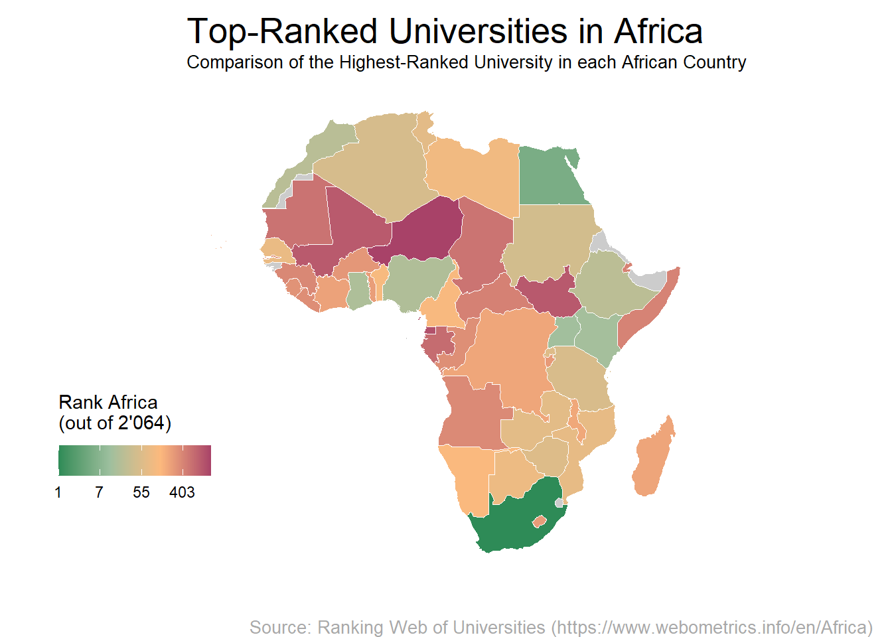

<!-- README.md is generated from README.Rmd. Please edit that file -->

# universityrankingafrica

<!-- badges: start -->
<!-- badges: end -->

This packages combines data collected as part of an MSc. Thesis Project.
The goal of this project was to build an openly accessible database with
data from the top ranked universities of each African country. The
project was supported by the Global Health Engineering group at ETH
Zurich, Switzerland.



## Installation

You can install the development version of universityrankingafrica from
[GitHub](https://github.com/) with:

``` r
# install.packages("devtools")
devtools::install_github("openwashdata/universityrankingafrica")
```

Alternatively, you can download the individual dataset as a CSV or XLSX
file from the table below.

| dataset           | CSV                                                                                                                 | XLSX                                                                                                                  |
|:------------------|:--------------------------------------------------------------------------------------------------------------------|:----------------------------------------------------------------------------------------------------------------------|
| ranking           | [Download CSV](https://github.com/openwashdata/universityrankingafrica/raw/main/inst/extdata/ranking.csv)           | [Download XLSX](https://github.com/openwashdata/universityrankingafrica/raw/main/inst/extdata/ranking.xlsx)           |
| african_countries | [Download CSV](https://github.com/openwashdata/universityrankingafrica/raw/main/inst/extdata/african_countries.csv) | [Download XLSX](https://github.com/openwashdata/universityrankingafrica/raw/main/inst/extdata/african_countries.xlsx) |

## MSc. Thesis Project

### Description

Data from institutional and national levels was combined into a dataset
to provide a comprehensive characterization of the top ranked
Universities of every African country. This was done to demonstrate the
correlation of certain attributes with the academic ranking performance.
The dataset also highlights the difficulties of accessing data from many
African Universities online.

### Research Question

Which attributes of an African university correlate with its performance
in an international ranking?

### Data

The data was collected between April and June 2023 using only the
official websites of the Universities. The ranking data originates from
the [Ranking Web of
Universities](https://www.webometrics.info/en/Africa). It’s worth noting
that while the World Ranking comprises 11’997 universities, the African
Ranking accounts for 2’064 universities. For the data collection at
hand, it was decided to only consider the 3 (at most) highest ranked
universities of each African country. The gathered data offers
interesting insights into the African academic landscape, mostly through
the process of combing through more than 140 websites in the search for
information. Generally, this data collection process gets more and more
difficult the further down the ranking performance goes: Navigation is
more confusing and useful information scarcer. Assisting institutions in
improving the quality of their web contents could be one possible avenue
for cooperation with African universities in the future.

The package provides access to two data sets.

``` r
library(universityrankingafrica)
```

The `universityrankingafrica` data set has 26 variables and 141
observations. For an overview of the variable names, see the following
table.

``` r
ranking
```

| variable_name          | variable_type                            | description                                                                                                                                                                                                                                                                                                                                                                                                                                                 |
|:-----------------------|:-----------------------------------------|:------------------------------------------------------------------------------------------------------------------------------------------------------------------------------------------------------------------------------------------------------------------------------------------------------------------------------------------------------------------------------------------------------------------------------------------------------------|
| university             | string                                   | Name of the University                                                                                                                                                                                                                                                                                                                                                                                                                                      |
| country                | drop-down from List of African countries | Country where the University is located                                                                                                                                                                                                                                                                                                                                                                                                                     |
| city                   | string                                   | City where the University is located                                                                                                                                                                                                                                                                                                                                                                                                                        |
| ror_entry_correct      | y / n                                    | Is the entry on the ror.org-website corresponding to the University correct? In most “n”-cases, the stated website is incorrect                                                                                                                                                                                                                                                                                                                             |
| url                    | URL                                      | Official website of the University                                                                                                                                                                                                                                                                                                                                                                                                                          |
| website_secure         | y / n                                    | Does the website use https? Is there no security related pop-up upon opening the website?                                                                                                                                                                                                                                                                                                                                                                   |
| website_up_to_date     | y / n                                    | Are news articles on the website up to date OR is the copyright date of the website the current year?                                                                                                                                                                                                                                                                                                                                                       |
| website_function       | good / medium / poor / defunct           | Good: navigating through the website is smooth, no OR very few dead or redundant links. Medium: some dead links within the webpage, some placeholders (“lorem ipsum”) still visible, some blank or empty pages. Poor: Navigating through the website is very difficult. Defunct: the official link of the university’s website is no longer hosted, or is otherwise inaccessible. Note: Does NOT indicate how much information can be found on the website. |
| website_language       | string                                   | Default language of the landing site                                                                                                                                                                                                                                                                                                                                                                                                                        |
| colonial_power         | string                                   | The colonial Power from which the country gained independence, if it ever was colonized or became independent.                                                                                                                                                                                                                                                                                                                                              |
| rank_africa            | int                                      | The rank of the University in Africa (2’064 universities), according to <https://www.webometrics.info/en/Ranking_africa>                                                                                                                                                                                                                                                                                                                                    |
| rank_world             | int                                      | The rank of the University in the World (11’997 universities), according to <https://www.webometrics.info/en/Ranking_africa>                                                                                                                                                                                                                                                                                                                                |
| impact_rank            | int                                      | The impact rank of the University, according to <https://www.webometrics.info/en/Ranking_africa>                                                                                                                                                                                                                                                                                                                                                            |
| openness_rank          | int                                      | The openness rank of the University, according to <https://www.webometrics.info/en/Ranking_africa>                                                                                                                                                                                                                                                                                                                                                          |
| excellence_rank        | int                                      | The excellence rank of the University, according to <https://www.webometrics.info/en/Ranking_africa>                                                                                                                                                                                                                                                                                                                                                        |
| academic_system        | American / French                        | Which academic system is used at the University: American (Undergraduate, Graduate, Doctorate) or French (LMD: Licence, Master, Doctorat)                                                                                                                                                                                                                                                                                                                   |
| engineering_courses    | int                                      | The number of different undergraduate engineering courses the University offers.                                                                                                                                                                                                                                                                                                                                                                            |
| years_of_study         | int                                      | Stated duration of an undergraduate engineering degree. If the University doesn’t offer engineering degrees, the duration of another undergraduate degree is indicated.                                                                                                                                                                                                                                                                                     |
| online_application     | y / n                                    | Is there a possibility to apply for the University online? If no explicit method is stated to send the application online, it’s considered as “no”                                                                                                                                                                                                                                                                                                          |
| international_students | y / n                                    | Does the University give special information to interested foreign students on how to enter?                                                                                                                                                                                                                                                                                                                                                                |
| yearly_fee             | int                                      | Required yearly tuition fee for a local student to complete a year of an undergraduate engineering degree at the University. If the University doesn’t offer engineering degrees, the general tuition fee is indicated                                                                                                                                                                                                                                      |
| masters_programme      | y / n                                    | Does the University offer Master’s programmes? (NOT only engineering)                                                                                                                                                                                                                                                                                                                                                                                       |
| online_payment         | y / n                                    | Is there a possibility to pay University fees online? (either banking information, instructions or a direct link)                                                                                                                                                                                                                                                                                                                                           |
| number_of_students     | int                                      | If stated on the website, the number of students studying at the University                                                                                                                                                                                                                                                                                                                                                                                 |
| access_date            | date (dd.mm.yyyy)                        | Date the University website was accessed                                                                                                                                                                                                                                                                                                                                                                                                                    |
| remarks                | string                                   | Personal notes on the University                                                                                                                                                                                                                                                                                                                                                                                                                            |

The `african_countries` data set has 7 variables and 55 observations.
For an overview of the variable names, see the following table.

``` r
african_countries
```

| variable_name  | variable_type          | description                                                                                                                                                                                                       |
|:---------------|:-----------------------|:------------------------------------------------------------------------------------------------------------------------------------------------------------------------------------------------------------------|
| countries      | string                 | Name of the Country                                                                                                                                                                                               |
| region         | string                 | African Region where the Country is located                                                                                                                                                                       |
| uni_count      | int                    | Number of Universities in the corresponding country                                                                                                                                                               |
| best_uni_rank  | int                    | Rank Africa of the best University of the country                                                                                                                                                                 |
| gdp            | int                    | GDP of the country in 2021 (With a few exceptions for which the data is older). Source: ourworldindata.org, World Bank, international-\$ in 2017 prices (accounting for differences in cost of living)            |
| gdp_per_capita | int                    | GDP per Capita of the country in 2021 (With a few exceptions for which the data is older). Source: ourworldindata.org, World Bank, international-\$ in 2017 prices (accounting for differences in cost of living) |
| hdi            | double between 0 and 1 | Human Development Index of the country in 2021. Source: ourworldindata.org, United Nations Development Programme (UNDP). Variable time span: 1990-2021. Higher number means better developped.                    |

## Example

### 1) Mapping Countries with the Best-Ranked Universities

The code below demonstrates how to create a map in R that highlights
countries hosting the top-ranked universities. This method involves
picking the best university in each country and associating its rank
with that specific country.

``` r
library(universityrankingafrica)
library(tidyverse)
library(sf)
library(rnaturalearth)


top_ranked_per_country <- african_countries |> 
  select(countries, best_uni_rank) 

world <- ne_countries(scale = "medium", returnclass = "sf")
africa_map <- left_join(world, 
                        top_ranked_per_country, by = c("name_long" = "countries")) |>  
  filter(continent == "Africa")

ggplot() +
  theme_void() +
  geom_sf(data = africa_map, aes(fill = best_uni_rank), color = "white", lwd = 0) +
  scale_fill_gradientn(name =  paste("Rank Africa", "\n(out of 2'064)"), 
                       trans = "log",
                       labels = scales::label_number(accuracy = 1),
                       colors = c("#2E8B57","#9DBF9E", "#FCB97D", "#A84268"),
                       na.value = "grey80",
                       guide = guide_colorbar(title.position = "top", title.vjust = 1.5)) +
  labs(title = "Top-Ranked Universities in Africa",
       subtitle = "Comparison of the Highest-Ranked University in each African Country",
       caption = "Source: Ranking Web of Universities (https://www.webometrics.info/en/Africa)") +
  theme(legend.position = c(-0.1, 0.3), legend.direction = "horizontal",
        plot.title = element_text(size = 20, hjust = 0, vjust = 0),
        plot.subtitle = element_text(size = 10, hjust = 0, vjust = 0.5),
        plot.caption = element_text(size = 10, color = "darkgray", hjust = -0.6)) +
  coord_sf(ylim = c(-40, 40))
```


### 2) Exploring Colonial’s Legacy on African University Ranking

This analysis investigates whether a correlation exists between the
colonial power that previously governed African nations and their
current university rankings.

``` r
library(universityrankingafrica)
library(tidyverse)
library(broom)

data <- ranking |> 
  filter(colonial_power %in% c("United Kingdom", "France", "Belgium", "Italy", "Portugal"))

# Create a scatter plot
ggplot(data, aes(x = colonial_power, y = rank_africa)) +
  geom_point() +
  labs(x = "Colonial Power at Independence", y = "Africa Rank") +
  ggtitle("University Ranking in Africa vs Colonial Power at Independence")
```


``` r

# Perform linear regression
model <- lm(rank_africa ~ colonial_power, data = data)
print(tidy(model))
#> # A tibble: 5 × 5
#>   term                         estimate std.error statistic p.value
#>   <chr>                           <dbl>     <dbl>     <dbl>   <dbl>
#> 1 (Intercept)                     449.       168.     2.68  0.00834
#> 2 colonial_powerFrance            201.       182.     1.11  0.271  
#> 3 colonial_powerItaly            -302.       335.    -0.900 0.370  
#> 4 colonial_powerPortugal           80.3      237.     0.339 0.735  
#> 5 colonial_powerUnited Kingdom   -117.       181.    -0.646 0.519

print(summary(model)$r.squared)
#> [1] 0.0895955
```

#### Interpretation

The model doesn’t provide strong evidence that the specific colonial
powers (France, Italy, Portugal, United Kingdom) significantly predict
the university rankings in Africa based on their p-values which are
greater than conventional thresholds like 0.05.. The low R-squared value
indicates that the model might not explain much of the variability in
the university rankings, suggesting that factors beyond colonial power
might influence these rankings significantly.

## License

Data are available as
[CC-BY](https://github.com/openwashdata/universityrankingafrica/LICENSE.md).

## Citation

To cite this package, please use:

``` r
citation("universityrankingafrica")
#> Um Paket 'universityrankingafrica' in Publikationen zu zitieren, nutzen
#> Sie bitte:
#> 
#>   Sigrist S, Skorik S (2023). "universityrankingafrica: University
#>   Ranking Africa."
#> 
#> Ein BibTeX-Eintrag für LaTeX-Benutzer ist
#> 
#>   @Misc{sigristskorik,
#>     title = {universityrankingafrica: University Ranking Africa},
#>     author = {Samuel Sigrist and Sophia Skorik},
#>     year = {2023},
#>     abstract = {What the package does (one paragraph).},
#>     version = {0.0.0.9000},
#>   }
```
